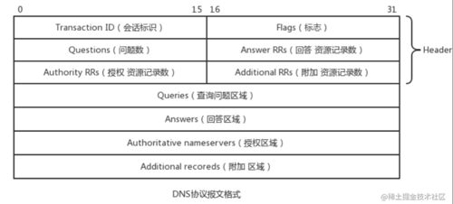
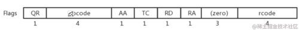
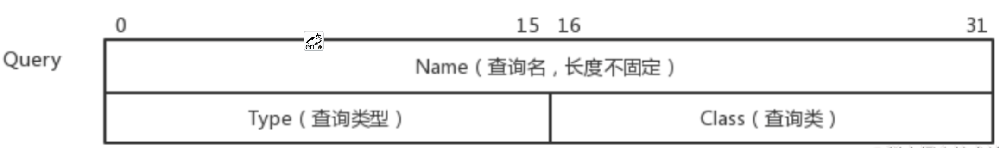
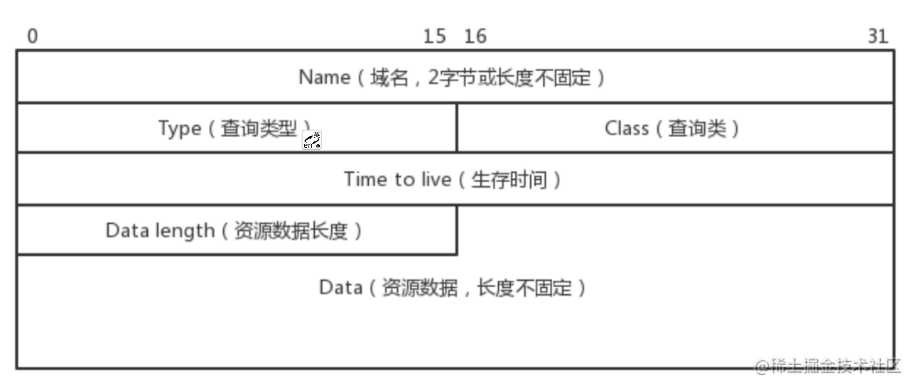

# DNS 简介

# 修改 DNS 地址
1. 在 mac 里可以打开系统偏好设置 --> 网络 --> 高级 --> DNS来查看和修改本地域名服务器的地址。
2. 修改为本地ip

## 响应类型
DNS 服务器上存储着域名和 IP 对应关系的记录，这些记录有 4 种类型：
A：A 就是查询到了域名对应的 IP，可以直接告诉客户端。
CNAME：CNAME 是给当前域名起个别名，两个域名会解析到同样的 IP。
NS：类型 NS 是需要去另一台 DNS 服务器做解析，比如顶级域名服务器需要进一步去权威域名服务器解析。
PTR：PTR 是由 IP 查询域名用的，DNS 是支持反向解析的
MX：而 MX 是邮箱对应的域名或者 IP，用于类似 @xxx.com 的邮件地址的解析。

## 协议格式

1. Transction ID 是关联请求和响应用的。
2. Flags 是一些标志位：

   
   
   * QR 是标识是请求还是响应。
   * OPCODE 是标识是正向查询，也就是域名到 IP，还是反向查询，也就是 IP 到域名。
   * 再后面分别是问题的数量、回答的数量、授权的数量、附加信息的数量
3. 问题 Queries 12 位置开始

   

   * name 比如 baidu.com
   * 查询的类型，就是上面说的那些 A、NS、CNAME、PTR 等类型。
   * 查询类一般都是 1，表示 internet 数据。
4. 回答格式

   

   * Name 也是查询的域名，
   * Type 是 A、NS、CNAME、PTR 等，
   * Class 也是和问题部分一样，都是 1。
   * Time to live，也就是这条解析记录要缓存多长时间。DNS 就是通过这个来控制客户端、本地 DNS 服务器的缓存过期时间的。
   * 最后就是数据的长度和内容了。
这就是 DNS 协议的格式。

